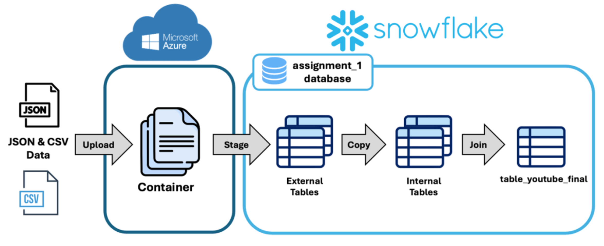
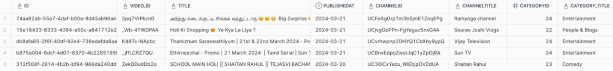

# Building a Snowflake Data Lakehouse to Analyse Global YouTube Trending Patterns

## 📌 Project Overview
YouTube is one of the world’s most influential platforms for content creation, entertainment, and information sharing. While millions of videos are uploaded daily, only a small fraction become *trending*, often reflecting cultural moments, viral content, and audience engagement patterns.

This project aims to **understand what makes videos trend** by building a **Data Lakehouse architecture in Snowflake** to ingest, transform and analyse large-scale YouTube trending data across multiple countries.

## Key Objectives
- Design and implement a **Snowflake Data Lakehouse**
- Ingest multi-source data (**CSV + JSON**) from cloud storage
- Clean and ensure data quality at scale
- Perform **SQL-based analytics** to uncover trends
- Translate insights into a **business content strategy**

## Dataset Description
- **Source:** YouTube Trending Dataset (via API, hosted on Kaggle)
- **Timeframe:** Aug 2020 – Apr 2024
- **Countries (10):** India, US, UK, Germany, Canada, France, Brazil, Mexico, Korea, Japan
- **Scale:** ~2.6 million rows

### Key Features:
- **Video Metadata:** `video_id`, `title`, `channel_title`, `trending_date`
- **Engagement Metrics:** `view_count`, `likes`, `dislikes`, `comment_count`
- **Categories:** `category_id` (mapped via JSON)

## Architecture Overview

### 1. Data Ingestion (`part_1.sql`)
- Uploaded datasets to **Azure Blob Storage**
- Created **Snowflake external stage**
- Built **external tables** for CSV and JSON data
- Parsed nested JSON using `LATERAL FLATTEN`
- Loaded into structured internal tables
- Final joined table: **`table_youtube_final` (~2.67M rows)**

Below is the overall workflow of the data ingestion process:

**Initial ingested data (raw Snowflake table):**

**Final dataset after cleaning and transformation (`table_youtube_final`):**

### 2. Data Cleaning (`part_2.sql`)
Key data quality steps:
- Resolved **duplicate category mappings**
- Filled missing category values (e.g. *Nonprofits & Activism*)
- Removed invalid records (e.g. `video_id = '#NAME?'`)
- Deduplicated records using `ROW_NUMBER()`
- Final cleaned dataset: **~2.60M rows**

### 3. Data Analysis (`part_3.sql`)

SQL queries were used to extract insights across multiple dimensions of YouTube trends:

- 🎮 **Gaming content performance**: Top gaming videos were largely consistent across Western countries, with titles like *Clash Royale* and creators such as *IShowSpeed* frequently appearing in top rankings.

- 🎤 **BTS content popularity**: Korea recorded the highest number of BTS-related videos (468), followed by India, indicating strong international fan engagement outside of the group’s home country.

- 📅 **Temporal viewing trends**: In early 2024, MrBeast dominated most countries’ top-viewed videos, while later months saw increased diversity with creators like BabyMonster and Mythri Movie Makers emerging.

- 📊 **Category dominance by country**: Entertainment dominated in most regions, while Gaming was stronger in North America and Science & Technology performed strongly in countries such as Japan and Mexico.

- 📺 **Channel performance**: Vijay Television was the most prolific channel overall, producing 2,049 distinct videos, significantly higher than the next highest channel.

### Key Insights:
- Global trends exist (e.g. shared top creators like *MrBeast*)
- Regional differences strongly influence content popularity
- Entertainment dominates globally, while Gaming is stronger in North America

## Business Problem (`part_4.sql`)

**Which YouTube category maximises trending potential for a new channel?**

### Key Findings:

- **Film & Animation emerges as the most consistently strong-performing category globally**, demonstrating sustained upward trends in average views over time and strong cross-country engagement, indicating high viral potential and broad audience appeal.

- **Science & Technology exhibits strong regional performance heterogeneity**, achieving high engagement in markets such as Japan and Mexico, suggesting that its success is more geographically concentrated and audience-specific.

- **Gaming remains a high-volume category but shows signs of declining efficiency**, with a large number of uploads but comparatively lower average views per video over time, indicating saturation and reduced marginal engagement.

### ✅ Final Recommendation:
- Focus on **Film & Animation** for global reach
- Adapt strategy for regional preferences where needed
- Consider additional metrics beyond views (e.g. engagement, virality)

## Tech Stack
- **Snowflake** (Data Lakehouse)
- **Azure Blob Storage**
- **SQL**
- **JSON Processing (LATERAL FLATTEN)**

## Key Takeaways
- Built an end-to-end scalable data pipeline
- Demonstrated handling of large, multi-source datasets
- Applied data engineering + analytics + business insight
- Highlighted importance of regional content strategies

## Future Improvements
- Incorporate machine learning for trend prediction
- Use real-time streaming data pipelines
- Expand analysis with engagement-based metrics

